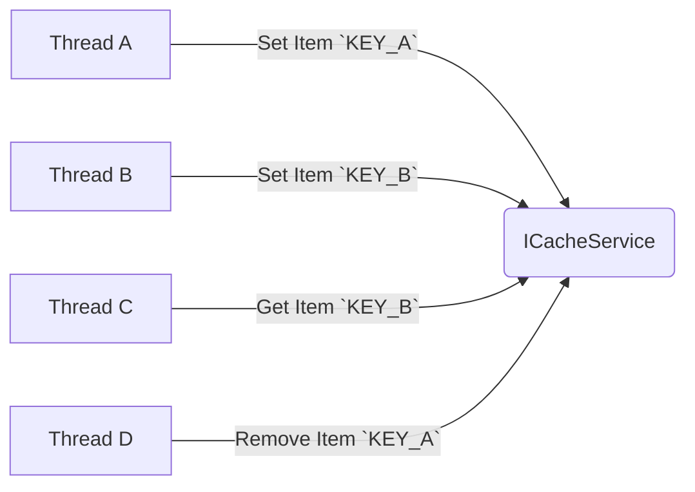

# Simple Cache
This service is used to cache any item with a key identifier.

## Requirements
You are expected to implement `ICacheService` interface, You have three functions in this interface:
```
public interface ICacheService
{
    bool Set<T>(string key, T value) where T : class;
    T Get<T>(string key) where T : class;
    bool Remove(string key);
}
```
To complete this exercise, you are required to keep in mind the following:
 - Cache service must be **thread-safe**
 - **Error handling** must be considered
 - Files **Not to changed**: `ICacheService.cs` and `SomeItem.cs`
 - Use **Microsoft Dependency Injection** to initialize implementation of `ICacheService`
 -  `Program.cs`: From line 14 till end file are the tests to confirm implementation. No code changes after line 13 of this file

