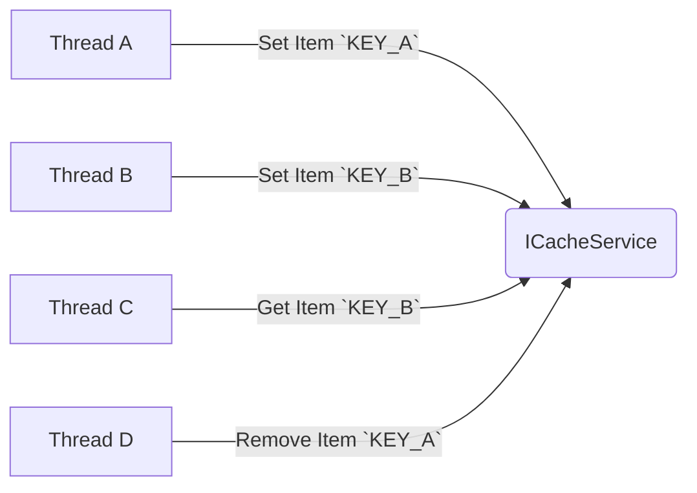

# Simple Cache
This service is used to cache any item with a key identifier.
I've implemented `ICacheService` interface, there are three functions in this interface:
```
public interface ICacheService
{
    bool Set<T>(string key, T value) where T : class;
    T Get<T>(string key) where T : class;
    bool Remove(string key);
}
```
Keep in mind the following:
 - Cache service is **thread-safe**
 - **Error handling** is considered 
 - I've used **Microsoft Dependency Injection** to initialize implementation of `ICacheService`
 -  `Program.cs`: From line 14 till end file are the tests to confirm implementation.



## Status (GitHub Actions)

[](https://github.com/gabriel-rodriguezcastellini/SimpleCache/actions/workflows/dotnet.yml) [](https://github.com/gabriel-rodriguezcastellini/SimpleCache/actions/workflows/codeql.yml)
